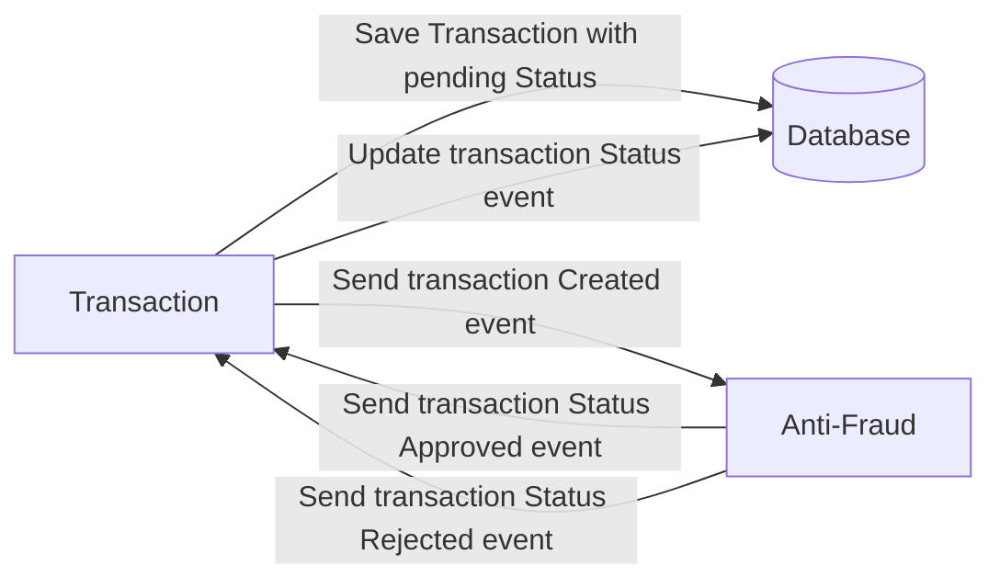

# Microservicios de Transacción y Anti-Fraude

## Microservicios conectados por Kafka

# Problema

Cada vez que se crea una transacción financiera, nuestro microservicio antifraude debe validarla y luego el mismo servicio envía un mensaje para actualizar el estado de la transacción.Por ahora, solo tenemos tres estados de transacción:

<ol>
  <li>pending</li>
  <li>approved</li>
  <li>rejected</li>  
</ol>

Toda transacción con un valor superior a 1000 debe ser rechazada.



## Tecnologias

- NodeJS, Nesjs
- TypeScript,
- ORM: TypeOrm,
- PostgreSQL
- Docker

## Diseño y Arquitectura

- El Proyecto tiene arquitectura hexagonal para mayor control de funcionalidades y escalabilidad, separando la entrada de datos, conexion a la base de datos y Logica de negocio.

## Run Locally

### 1. Clone repo

```
$ git https://github.com/jhonntantb/app-nodejs-codechallenge
$ cd app-nodejs-codechallenge
```

### 2. Ejecutar Docker-Compose

- Instalar docker en tu computadora [docker](https://www.docker.com/products/docker-desktop)

```
$ docker-compose up -d
```

## 3. Conectarse a la Base de datos

- En este proyecto use una base de datos alojada en la nube, proporcionada por supabase, el cual es un servicio gratuito. Para lo cual necesitamos un archivo con variables de entorno que detallo en el siguiente apartado.

### 4. Crear archivo .env

- Crear archivo .env en la carpeta transaction
- Debe contener los siguientes datos:

```
DB_HOST=db.bdmntvuhcgabuzknlelp.supabase.co
DB_PORT=5432
DB_USER=postgres
DB_PASS=1yB4xoRHgPZhm26X
DB_NAME=postgres
```

### 5. Run Microservices

#### 5.1 Run Microservice Transaction

```
$ cd transaction

$ npm install

$ npm run start
```

- the server continue listening

```
$ npm run start:dev
```

#### 5.1 Run Microservice Transaction

```
$ cd anti-fraud

$ npm install

$ npm run start
```

- the server continue listening

```
$ npm run start:dev
```

### 6. Ver Documentación de la API

- Ejecuta esto en su navegador: http://localhost:8080/docs
- Click en la ruta
- Ver Parametros
- Probar la API

## Support

- Contact Developer: [Jhonntan](mailto:Jhonntan.jhonntantb@gmail.com)
